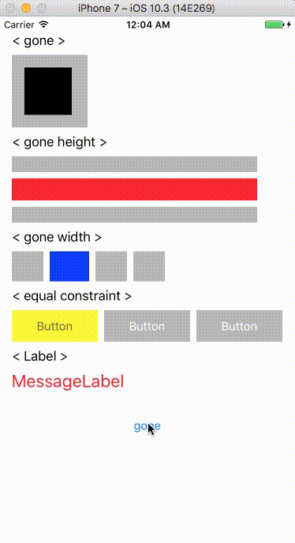

# GoneVisible

[](https://developer.apple.com/iphone/index.action)
[](https://developer.apple.com/swift)
[](http://mit-license.org)
[](http://twitter.com/snoozelag)

**GoneVisible is a UIView extension that uses AutoLayout to add "gone" state like Android.**  

You can easily change the size constraint constant of UIView to 0 without adding IBOutlet property of size constraint. GoneVisible supports iOS and is written in Swift.

Additional notes:
This library will be useful for projects targeting iOS 8. If your project is targeting iOS 9 or higher, I recommend you consider implementing with UIStackView before using this library.
　  
　  


## Requirements ##
* Swift 4.0
* iOS 8.0+
* Xcode 9

## Installation ##
#### Manual ####
Simply drag `UIView+GoneVisible.swift` into your project.

#### Cocoapods ####
- Add into your Podfile.

```:Podfile
pod "GoneVisible"
```

Then `$ pod install`
- Add `import GoneVisible` to the top of your files where you wish to use it.

## Usage ##

・Gone.
```swift
view.gone()
```

・Visible.
```swift
view.visible()
```

・When setting to Gone, set the space constraint constant together to 0.
```swift
view.gone(spaces: [.trailing])
```

・With "gone" you can specify whether it is vertical or horizontal. It is useful when animating.
```swift
view.gone(axis: .vertical)
```

## Example Code ##
Here is the code for this example project. You do not need to import constraints by IBoutlet to control size. 
```swift
import UIKit
import GoneVisible

class ViewController: UIViewController {

    @IBOutlet weak private var blackView: UIView!
    @IBOutlet weak private var redView: UIView!
    @IBOutlet weak private var blueView: UIView!
    @IBOutlet weak private var yellowButton: UIButton!
    @IBOutlet weak private var errorMessageLabel: UILabel!
    @IBOutlet weak private var toggleSwitch: UISwitch!

    override func viewDidLoad() {
    super.viewDidLoad()

        // When you want to display in "gone" state from the beginning.
//        toggleSwitch.isOn = false
//        goneViews()
    }

    @IBAction func toggleSwitchValueChanged(_ sender: UISwitch) {
        if toggleSwitch.isOn {
            visibleViews()
            UIView.animate(withDuration: 0.3) { view.layoutIfNeeded() }
        } else {
            goneViews()
            UIView.animate(withDuration: 0.3) { view.layoutIfNeeded() }
        }
    }

    private func goneViews() {
        blackView.gone()
        redView.gone(axis: .vertical, spaces: [.bottom])
        blueView.gone(axis: .horizontal, spaces: [.trailing])
        yellowButton.gone(axis: .horizontal, spaces: [.trailing])
        errorMessageLabel.gone(axis: .vertical)
    }

    private func visibleViews() {
        blackView.visible()
        redView.visible()
        blueView.visible()
        yellowButton.visible()
        errorMessageLabel.visible()
    }

}
```

##### See also:  
- [:link: iOS Example Project](https://github.com/snoozelag/GoneVisible/tree/master/Example/GoneVisibleExample)
  
## Author

Teruto Yamasaki, y.teruto@gmail.com

## License ##
  
The MIT License (MIT)  
See the LICENSE file for more info.  
